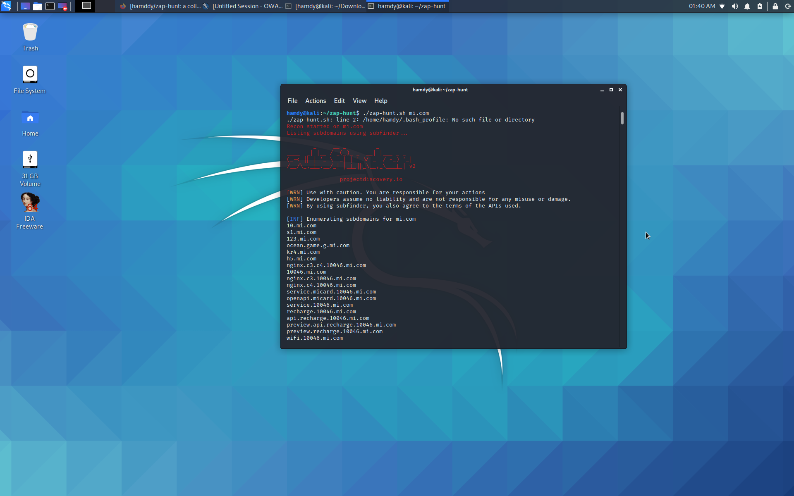
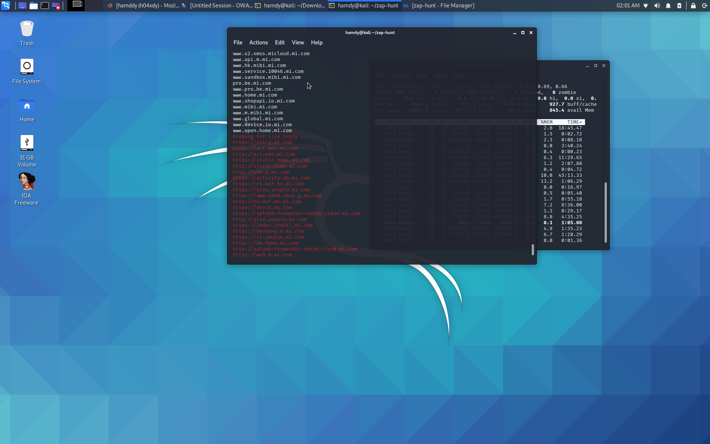
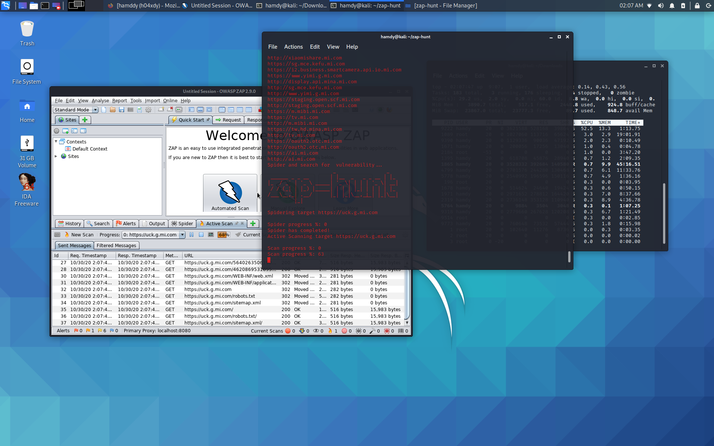

# zap-hunt
a collection of bash script and python to automate ZAP Security Tests 


# Installation 
you need to install (zaproxy ,  httprobe , subfinder , OWASP ZAP Python API) 


  * [zaproxy](https://www.zaproxy.org/)
  * [httprobe](https://github.com/tomnomnom/httprobe)
  * [subfinder](https://github.com/projectdiscovery/subfinder)
  * [OWASP ZAP Python API](https://github.com/zaproxy/zap-api-python)


    you need  to change api key and the port ZAP runs on (defaults to 8080) on zspider.py line 8 , 22  
    ```python
    apikey = 'olg7ai1777h7ff0353gafnok9l' # you can get this from tools > option > apikey
    zap =ZAPv2(apikey=apikey, proxies={'http': 'http://127.0.0.1:8080', 'https': 'http://127.0.0.1:8080'})
    ```


# Usage 
 ```python
  git clone https://github.com/hamddy/zap-hunt.git
  
  cd zap-hunt && sudo chmod +x zap-hunt.sh zspider.py
  
  bash zap-hunt.sh  "your subdomain here"
  ```


# Main features
 * search for subdomains 
 * looking for http and https
 * spider and scan with zaproxy
 
 
 
 

# Screenshot
  
  
  

 
 
 
 
# Reccommendations

* DO NOT USE ZAProxy or this ZAProxy automation tools collection to hack web sites and web applications you don't own or you don't have a written permission to pen-test.

* I do not assume any responsabilities for your actions, nor for the content of this repository.

* This automation tools collection sole purpose is to help people (especially the ones who can't afford expensive security solutions) to test security of their web applications and web sites to improve the quality and security of this world and not to make it worst!


